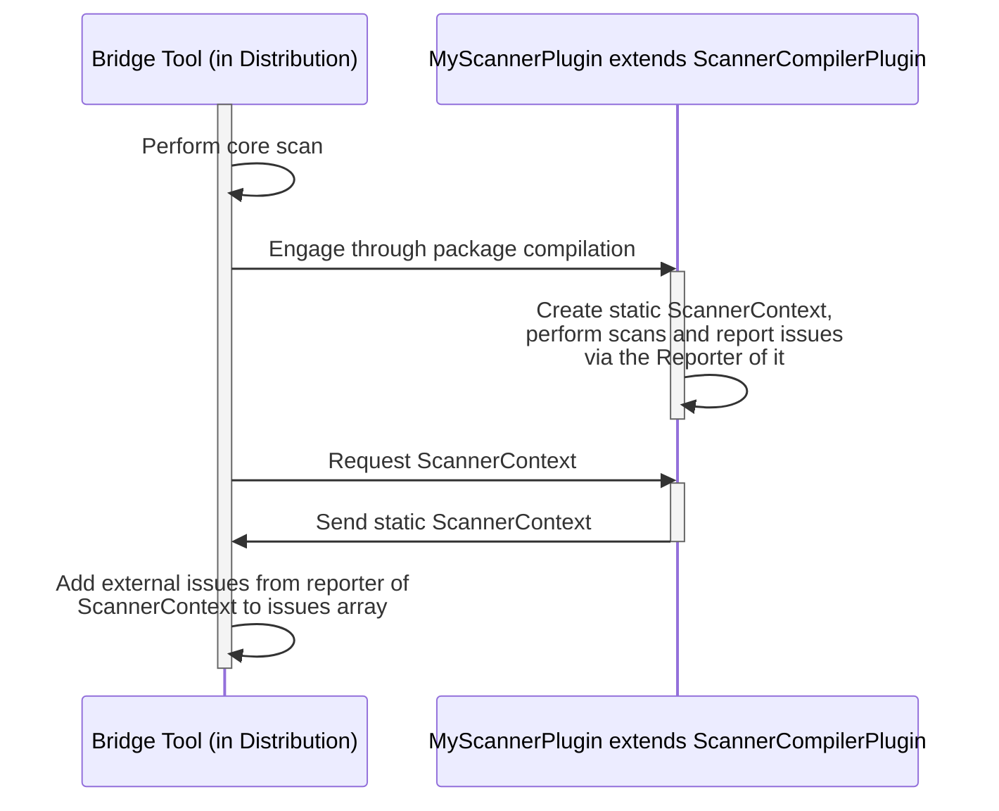

# Architecture: Ballerina Distribution Bundling based Approach



# Ballerina Tool extension methods

Ballerina language has two main extension points:

- Ballerina Tools
- Ballerina Compiler Plugins

This project aims to extend the functionalities of a Ballerina tool via compiler plugins and simulate a
simplified version of the Ballerina scan tool

## Ballerina Tools

Allow developers to create custom Ballerina commands like:

```cmd
bal bridge
```

## Ballerina Compiler Plugins

Allow developers to extend features of the Ballerina compiler

```bal
import org/custom_compiler_plugin as _;

public function main(){
}
```

## Prerequisites

The following software should be installed locally

- [Java version: 17](https://adoptium.net/temurin/releases/?version=17)
- [Ballerina version: 2201.8.4](https://ballerina.io/downloads/archived/#swan-lake-archived-versions)

## Getting started

1. Create the custom compiler plugin by following the
   instructions [here](https://github.com/Xenowa/ballerina-tool-extension-methods/tree/tool-plugin-based-approach/CustomCompilerPlugin)

2. Create the bal bridge tool by following the
   instructions [here](https://github.com/Xenowa/ballerina-tool-extension-methods/tree/tool-plugin-based-approach/BridgeCommand)

3. Navigate to the test-bridge-command directory

4. Run "bal bridge" command